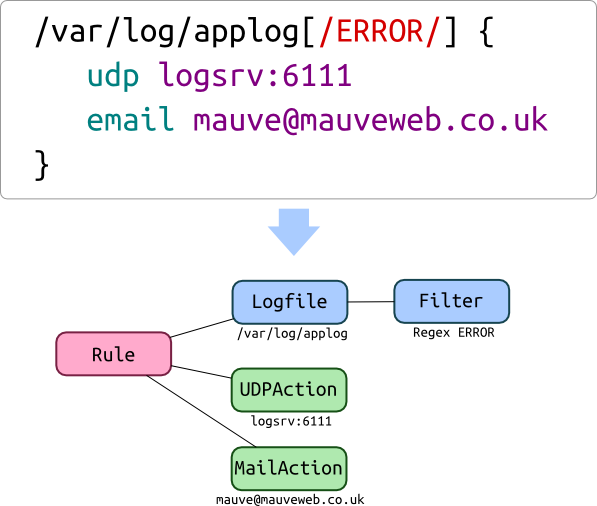
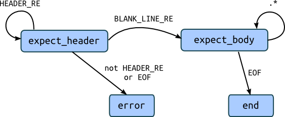
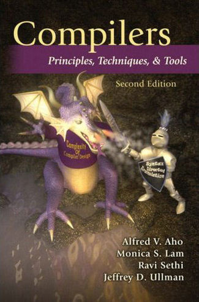

Writing Domain Specific Languages in Python
^^^^^^^^^^^^^^^^^^^^^^^^^^^^^^^^^^^^^^^^^^^

The Unabridged Guide

Daniel Pope / @lordmauve

Introduction
============

What is a Domain Specific Language
----------------------------------

* A **domain** means a problem space.
* A **Domain Specific Language (DSL)** is a language designed to better solve
  problems in that space.

SQL
---

.. code-block:: sql

    SELECT p.id, p.name, p.age
    FROM person p
    WHERE p.age > 20
    ORDER by p.name ASC

CSS
---

.. code-block:: css

    header#front h1 {
        font-size: 2em;
        color: white;
    }

Regular Expressions
-------------------

Regular expressions with `re`::

    r'(?<=[A-Z])[a-z]+'

configparser
------------

.. code-block:: ini

    [ui]
    username = Daniel Pope <mauve@mauveweb.co.uk>

    [extensions]
    rebase =
    mq =

    [merge-tools]
    # Swap the order of panels in meld so that it is easier to move changes
    # from other to local, which is the most common operation
    meld.args=--label='local' $local --label='other' $other --label='base' $base

String Formatting
-----------------

``str.format()`` and ``datetime.strftime()``/``.__format__()``:

.. code-block:: python

    >>> now = datetime.datetime.now()
    >>> "The time is now {date:%I:%M%p} on {date:%d %B %Y}".format(date=now)
    'The time is now 11:32PM on 05 July 2015'

reStructuredText
----------------

.. code-block:: rst

    Why would we want to write a DSL
    --------------------------------

    Let's look at a few of the well known DSLs in Python.

    .. code-block:: sql

        SELECT p.id, p.name, p.age
        FROM person p
        WHERE p.age > 20
        ORDER by p.name ASC

Why DSLs?
---------

.. rst-class:: build

* Improve readability
* Reduce repetition (and improve writability)
* Manipulate input (eg. validate, transform, sanitise)
* For editing by non-technical/non-Python people

What might want from DSLs in Python
-----------------------------------

* Use Python for implementation
* Use Python where Python is good
* Mix Python and DSL code - eg in triple-quoted strings
* Preserve the readability of python

What we need to build a DSL
---------------------------

* A way of constructing structure in Python
* The Python code to evaluate that structure

Abstract Syntax Tree
--------------------

Python Metaprogramming DSLs
===========================

Metaclasses
-----------

Python has built-in semantics for a class definition that you probably know
well::

    >>> class Duck:
    ...    def quack(self):
    ...        print("quack")
    ...
    >>> print(Duck)
    <class '__main__.Duck'>
    >>> Duck()
    <__main__.Duck instance at 0x7f1b9db36200>
    >>> Duck().quack()
    quack

Metaclasses
-----------

.. code-block:: python

    class ScrapedReview(Scraper):
        category = StringFact("h2/span/text()")
        title = StringFact("h2/text()")
        teaser = StringFact("h2/preceding-sibling::h3//text()")
        description = ListFact("p[@class = 'description'//text()")

        def clean_category(self, value):
            return re.sub(':$', '', value)

.. code-block:: python

    >>> ScrapedReview(url)
    {'category': 'Food and drink', 'title': 'Bilbao Tapas', ...}

Writing a metaclass
-------------------

.. code-block:: python

    class Fact:
        ...
        def get(self, doc):
            return doc.xpath(self.xpath, current=doc)

Writing a metaclass
-------------------

.. code-block:: python

    class ScraperMeta(type):
        def __new__(cls, name, bases, dict):
            """Collect facts from class dict"""
            dict['_facts'] = {k: v for k, v in dict if isinstance(v, Fact)}
            return type.__new__(cls, name, bases, dict)

        def __call__(cls, url):
            doc = lxml.etree.parse(url)
            d = {}
            for name, fact in cls._facts.items():
                value = fact.get(doc)
                cleaner = getattr(self, 'clean_' + name, None)
                if callable(cleaner):
                    value = cleaner(value)
                d[name] = v
            return d

Writing a metaclass
-------------------

.. code-block:: python

    class Scraper(metaclass=ScraperMeta):
        pass

Context managers
----------------

.. code-block:: python

    with html():
        with body():
            h1('Context Manager DSLs')
            p('The', bold('with statement'), 'can be used to construct a DSL')

Operator Overloading
--------------------

.. code-block:: python

    BlogPost.objects.filter(
        Q(author__name__icontains='daniel') |
        Q(published__lte=datetime.datetime.now())
    )

Operator Overloading
--------------------

Spotted in a real codebase::

    >>> w = (Where('age') >= 18) & \
    ...     (Where('nationality') <<inlist>> ['British', 'Spanish'])
    >>> w.sql()
    "`age` >= 18 AND `nationality` IN ('British', 'Spanish')"

What the <<infix>>?
-------------------

Probably evaluated like this::

    (left << infix) >> right

Using operator overloading like this::

    class Where:
        def __lshift__(self, op):
            return UnboundExpression(self, op)

    class UnboundExpression:
        ...

        def __rshift__(self, arg):
            return self.op(self.lhs, self.arg)

    inlist = Infix('in')

Precedence Fail!
----------------

This::

    Where('age') >= 18 & Where('nationality') <<inlist>> ['British', 'Spanish']

will actually be executed as::

    Where('age') >= ((18 & Where('nationality')) <<inlist>> ['British', 'Spanish'])

...which is almost certainly not what is intended.

Semantics Fail!
---------------

.. code-block:: python

    >>> table.age
    <Table object at 0x7f03cd8a3630>
    >>> table.age == None
    [False, False, False, True, False]
    >>> table[table.age == None]
    ...

.. code-block:: python

    >>> table == None
    [False, False, False, False, False]

.. code-block:: python

    self.assertEqual(
        table,
        None
    )

AST-based parsing
-----------------

Use Python's own parser, the ``ast`` module::

    Person.select("age > 20 and nationality in ['British', 'Spanish']")

.. code-block:: python

    class SQLTransformer(ast.NodeVisitor):
        def visit_boolop(self, node):
            if node.op == ast.And:
                op = ' AND '
            else:
                ...
            return op.join(self.visit(e) for e in node.values)

        ...

    def select(expr):
        root = ast.parse(expr, mode='eval')
        sql = SQLTransformer().visit(root)

Implicit AST Manipulation
-------------------------

Spotted in the wild::

    @graphnode
    def PageTitle(self):
        return self.Name or self.Doc.Name

Similar but subtly different semantics (eg. exceptions do not work, ``or`` is
not lazy-evaluating).

* ``inspect.getsource()`` to find the source
* ``ast`` to parse, rewrite, and recompile it

Pony ORM
--------

.. code-block:: python

    >>> select(p for p in Person if p.age > 20)[:]

    SELECT "p"."id", "p"."name", "p"."age"
    FROM "Person" "p"
    WHERE "p"."age" > 20

    [Person[2], Person[3]]

* Decompile bytecode back to AST-like structure
* Decompilation is a special case of compilation :)

Python Metaprogramming Tricks
-----------------------------

* Developer surprise
* Often no clear distinction between code that will execute with Python
  semantics and code that won't
* Some Python constructs end up unsupported
* Hard to extend in arbitrary ways
* Metaclasses seem like the cleanest approach

Other off-the-shelf parsers
===========================

Generic data interchange formats
--------------------------------

* ``json``
* ``configparser``
* ``yaml``
* Even XML. Eek!

Each of these formats comes with its own set of syntax that is not necessarily
aligned to your domain.

ElasticSearch DSL
-----------------

.. code-block:: javascript

    {
        "query": {
            "bool": {
                "must": [{
                    "match_phrase_prefix": {
                        "title": {"query": query, "analyzer": "prose"}
                    }
                }],
                "should": [
                    {"term": {"_type": {"value": "city", "boost": 1.0}}}
                ],
            }
        },
        "fields": ["coding", "primary_city", "city_name", "title", "category"],
        "highlight": {
            "fields": {"title": {}}
        }
    }

Ansible Playbook
----------------

.. code-block:: yaml

    - user: name={{ item.name }} state=present generate_ssh_key=yes
      with_items: "{{users}}"

    - authorized_key: "user={{ item.0.name }} key='{{ lookup('file', item.1) }}'"
      with_subelements:
         - users
         - authorized

Aside: Is YAML really human-readable?
-------------------------------------

.. rst-class:: build

    .. code-block:: yaml

        Terminator (series):
            - The Terminator
            - Terminator 2: Judgement Day
            - Terminator 3: Rise of the Machines
            - Terminator Salvation
            - Terminator Genisys

    .. code-block:: yaml

        canada:
            MB: Manitoba
            NS: Nova Scotia
            ON: Ontario
            QC: Quebec
            SK: Saskatchewan

Off-the-shelf parsers
---------------------

* Verbose
* Hard to extend
* May not be that readable

Parsing our own DSLs
====================

How to design a DSL
-------------------

1. Sit down with a blank file
2. Express your ideas in the simplest way you can
3. Iterate. Or throw away and start again.
4. Produce a variety of examples.
5. Split your examples into test cases.

Design first, write a parser later.

Considerations when designing a DSL
-----------------------------------

* Focus on expressiveness and readability
* Minimise the complexity of the language
* Use familiar paradigms
* Avoid too much syntactic sugar too early
* Write comments!
* If intended for use within a Python string literal, avoid syntax that could
  cause problems with Python's own string escaping.

How will you parse this language?

Linewise Parsing
----------------

Before::

    t = Table([
        ('int', 'ReviewID'),
        ('str', 'Ticket')
    ])
    t.extend([
        (1000, 'QRX-1'),
        (2000, None),
    ])

After::

    table_literal("""
    | (int) ReviewID | Ticket |
    | 1000           | QRX-1  |
    | 2000           | None   |
    """)

Linewise Parsing
----------------

* Number of parser states
* Start in initial state
* For each line of input, switch on state

  * Maybe output/store some value
  * Maybe transition to another state

Finite State Machine
--------------------

Finite State Machine
--------------------

.. code-block:: python

    state = READ_HEADER
    for line in source.splitlines():
        line = strip_comments(line)
        if state is READ_HEADER:
            if not line:
                state = READ_BODY
                continue

            match = re.match(r'^([^:]+):\s*(.*)', line)
            if match:
                key, value = match.groups()
                headers[key] = value
            else:
                raise ParseError("Invalid header line %s")
        elif state is READ_BODY:
            ...

Class-based approach
--------------------

.. code-block:: python

    class MyParser:
        def process_header(self, line):
            ...
            if ...:
                self.state = process_body

         def process_body(self, line):
            ...

        INITIAL_STATE = process_header

        def parse(self, f):
            self.state = self.INITIAL_STATE
            for l in f:
                self.state(l)

Finite state machine
--------------------

* Can parse only regular grammars
* Add your own stack and other state to do much better

* Considering one line at a time
* But structure can span multiple lines

Parsing Theory
==============

You (probably) don't need to read this book!
--------------------------------------------

*Compilers, Principles, Techniques and Tools* by Aho, Lam, Sethi and Ullman,
ISBN 0321486811

Lexical Analysis, Syntax Analysis
---------------------------------

Commonly parsers are split into two phases:

* **Lexical Analysis**, (or **tokenisation**) - source is split into a sequence
  of **tokens**

* **Syntax Analysis** - the sequence of tokens is transformed into a structure
  called an **abstract syntax tree**.

Lexical Analysis
----------------

.. code-block:: python

    (x ** y) + 1

With ``tokenize`` module:

.. code-block:: python

    [
        (tokens.OP, '('),
        (tokens.NAME, 'x'),
        (tokens.OP, '**'),
        (tokens.NAME, 'y'),
        (tokens.OP, ')'),
        (tokens.OP, '+'),
        (tokens.NUMBER, '1'),
    ]

Syntax Analysis
---------------

.. code-block:: python

    (x ** y) + 1

``ast`` (ostensibly using ``tokenize`` behind the scenes):

.. code-block:: python

    BinOp(
        left=BinOp(
            left=Name(id='x', ctx=Load()),
            op=Pow(),
            right=Name(id='y', ctx=Load())
        ),
        op=Add(),
        right=Num(n=1)
    )

Returning to linewise parsers
-----------------------------

* Each line is a token

Interlude: Pyweek
-----------------

Each line is a token
--------------------

.. code-block:: restructuredtext

    Act 1
    =====
    [pause]
    [GOBLIT enters]
    GOBLIT: Hello?
    WIZARD TOX: hmm?
    [pause]
    GOBLIT: I say, hello? Grand Wizard Tox?
    [WIZARD TOX turns around]
    WIZARD TOX: *sigh* Yes?
    .. choose-all::
        .. choice:: My name is Goblit.
            GOBLIT: I'm Goblit.
            WIZARD TOX: Goblet? That's a strange name.

        .. choice:: About the assistant role?
            GOBLIT: I was told you need an assistant?
            WIZARD TOX: A vacancy has become available, yes.

Parser Generators
=================

Grammars
--------

The grammar for a simple calculator expression language may look like this:

.. code-block:: ebnf

    expr -> expr '+' term | expr '-' term | term

    term -> term '*' factor | term '/' factor | factor

    factor -> '\d+' | '(' expr ')'

Associativity
-------------

Let's look at the expression::

    a + b + c

If the ``+`` operator is **left associative** then this is equivalent to ::

    (a + b) + c

If it is **right associative** then this is equivalent to ::

    a + (b + c)

Operator Precedence
-------------------

Operator precedence is about which operators are bracketed *first*. Look at
the expression::

    a + b * c

Standard mathematical rules would bracket this as ::

    a + (b * c)

``*`` has higher operator precedence than ``+``.

Precedence is important
-----------------------

If ``+`` had the same precedence as ``*`` then the associativity would take
over, and the expression would be parsed as::

    (a + b) * c

The Principal of Least Surprise is required here.

PLY: Tokeniser
--------------

.. code-block:: python

    import ply.lex as lex

    tokens = 'ADDOP MULOP LPAREN RPAREN NUMBER'.split()

    t_ADDOP = r'[+-]'
    t_MULOP = r'[*/]'
    t_LPAREN = r'\('
    t_RPAREN = r'\)'

    def t_NUMBER(t):
        r'\d+'
        t.value = int(t.value)
        return t

    t_ignore = ' \t'

    lexer = lex.lex()

PLY: Parser
-----------

.. code-block:: python

    from mylexer import lexer, tokens
    import ply.yacc as yacc

    precedence = [('left', 'ADDOP'), ('left', 'MULOP')]
    OPERATORS = {'+': operator.add, '-': operator.sub,
                 '*': operator.mul, '/': operator.truediv}

    def p_expression_binop(t):
        '''expression : expression ADDOP expression
                      | expression MULOP expression'''
        left, op, right = t[1:]
        t[0] = OPERATORS[op](left, right)

PLY: Parser
-----------

.. code-block:: python

    def p_expression_group(t):
        'expression : LPAREN expression RPAREN'
        t[0] = t[2]

    def p_expression_number(t):
        'expression : NUMBER'
        t[0] = t[1]

    parser = yacc.yacc()

PLY: Usage
----------

.. code-block:: python

    from myparser import parser
    from mylexer import lexer

    def eval_expr(inp):
        return parser.parse(inp, lexer=lexer)

.. code-block:: python

    >>> eval_expr('(1 + 3) / 10')
    0.4

PyParsing: token matchers
-------------------------

.. code-block:: python

    import ast
    from pyparsing import *

    STRING_CONSTANT = QuotedString('\'',
                                   escChar='\\', unquoteResults=False)
    INT_CONSTANT = Regex(r'-?\d+(?!\.)')
    FLOAT_CONSTANT = Regex(r'-?\d*\.\d+')
    COMMA = Literal(',')

PyParsing: Combinations
-----------------------

.. code-block:: python

    CONSTANT = STRING_CONSTANT | FLOAT_CONSTANT | INT_CONSTANT

    VALUE = Forward()
    LIST = (Literal('(') + Optional(VALUE + ZeroOrMore(COMMA + VALUE) +
            Optional(COMMA)) + Literal(')'))
    VALUE <<= CONSTANT | LIST

PyParsing: Parse Actions
------------------------

.. code-block:: python

    CONSTANT.setParseAction(lambda toks: ast.literal_eval(toks[0]))
    LIST.setParseAction(lambda toks: [toks[1:-1:2]])

Pyparsing: Usage
----------------

.. code-block:: python

    inp = input()
    res = VALUE.parseString(inp)[0]
    print(res)

.. code-block:: python

    >>> parse('(1, 2, (4, 5))')
    [1, 2, [4, 5]]

Parsley
-------

.. code-block:: python

    parser = parsley.makeGrammar("""
        number = <digit+>:ds -> int(ds)
        ws = ' '*
        expr = number:left ws ('+' ws number:right -> left + right
                              |'-' ws number:right -> left - right
                              | -> left)
    """)

.. code-block:: python

    >>> parser('4 + 3 - 1').expr()
    6

"WHERE" expressions revisited
-----------------------------

Before:

.. code-block:: python

    ((Where('age') >= 18) &
     (Where('nationality') <<inlist>> ['British', 'Spanish']))

After:

.. code-block:: python

    where("""age >= 18 AND nationality IN ['British', 'Spanish']""")

Metric definition language
--------------------------

.. code-block:: text

    # Base class for all hosts; Monitors memory and load
    class aws-host extends base {
        metric "cpu.load.5min" {
            alert at severity 2 if value > 150 for 5m;
        };

        use disk("/");
        use disk("/srv");
    }

    # Monitor disk usage
    define disk($device) {
        metric "disk.$device.used_percent" as "Disk usage on $device" {
            alert at severity 1 if value = 100;
            alert at severity 2 if value > 98;
            alert at severity 3 if value > 90;
        };
    }

Working with DSLs
=================

Things you may need
-------------------

* Function to convert an AST to string (round-trip source <-> ast)

* Clear syntax errors

  * should include line number

* IDE Support

  * Linting
  * Syntax highlighting

Editor support
--------------

Now you know how to write a tokenizer, this should be easy...!

.. code-block:: vim

    syn keyword Keyword       class define node use metric alert
    syn keyword Label         as format at severity if for value inherits using
    syn match cmpOp '>\|<\|==\|!='
    syn match String '"[^"]*"' contains=Variable,QVariable
    syn match Number '[0-9]\+[hms]\?'
    syn match Comment  "\s*#.*$"
    syn match Identifier '[A-Za-z][A-Za-za-z.-]*'
    syn match Variable "\$\w\+"
    syn match QVariable "\${\w\+}" contained
    hi link Variable Include
    hi link Label Type
    hi link cmpOp SpecialChar
    hi link QVariable Variable

    let b:current_syntax = "metricrules"

Pros and cons of DSLs
---------------------

Advantages:

* More readable code
* More developer productivity
* Fewer bugs - if done well!
* Security - not using eval(), XML exploits etc

Disadvantages:

* Learning curve for newbies
* No tooling support (IDEs, linters, documentation tools)

Thank you
=========

Daniel Pope / @lordmauve / http://bitbucket.org/lordmauve
